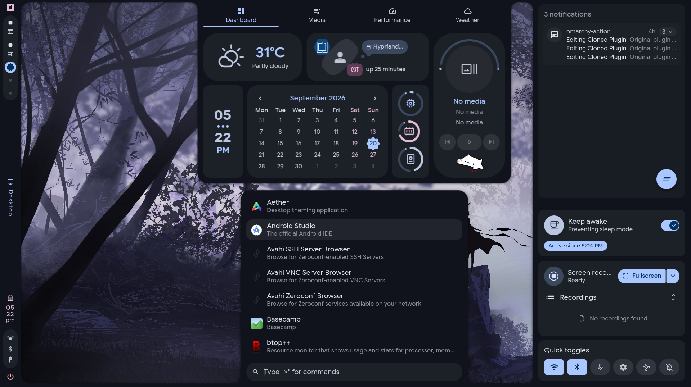

# Omacale

> A [Caelestia](https://github.com/caelestia-dots/shell)-inspired desktop shell for [Omarchy](https://omarchy.org).



Omacale is a modular bar and desktop shell plugin (`omacale.bar`) built for Omarchy. It runs natively inside Omarchy's Quickshell runtime with no secondary daemons, no C++ compilation, and zero manual Hyprland configuration required.

---

## ✨ Features

- **SDF Frame & Drawers**: Unified screen border and smooth slide-out drawers powered by Caelestia's `blob.frag` shader.
- **Material 3 Palette**: Dynamically derives M3 color roles from your active Omarchy theme accent (`omarchy theme set`).
- **Interactive Bar**: Shape-based workspace indicator, active window title, system tray, clock, and hover popouts for network, Bluetooth, and battery. Picking a secured Wi-Fi network turns the network popout into a password card, as Caelestia does. Hovering the window title shows a live preview; its chevron opens the window info panel (details, move to workspace, float/tile, pin, kill), also reachable with `omarchy-shell omacale windowInfo`. An optional keyboard-layout status icon (Settings › Taskbar › Status icons) shows the active layout and opens a popout to switch between the configured ones.
- **Bar space management**: status icons can be set to show only when they matter (bluetooth when connected, microphone while recording), the tray collapses behind a chevron (Caelestia's compact tray, plus per-icon hiding), and third-party widgets are pinned or wait behind the plugin pill's chevron. When the bar runs out of room they collapse on their own, in that order, so the window title keeps its space.
- **Plugin Manager**: Settings › Plugins lists every Omarchy plugin, built-in and third-party, with filters, search, an enable switch, per-plugin details, and add (from git) / update / remove through `omarchy plugin`.
- **Third-party Bar Widgets**: Enabled Omarchy bar widgets are hosted in a Caelestia-styled pill, with multi-monitor broadcasts, keyboard popouts, and click hand-off preserved. Every widget's mark is scaled to the size of the status icons, one status-icon cell each; a short horizontal label (e.g. ELIZA) is shown whole and turned like the window title, and anything longer gets a category icon while keeping its original action and popup. A widget that hides itself takes no space, and the pill hides when none are showing.
- **Dashboard**: Integrated weather, calendar, live hardware monitors, and a media player with synced lyrics and audio visualizer.
- **Application Launcher**: Fast app search, Omarchy actions, wallpaper/theme carousels (`>wallpaper`, `>theme`), a calculator (`>calc 2+3*4`; Enter copies the answer, and with `qalc` installed a button opens it in the terminal), and direct access to the Omarchy menu (`:` prefix).
- **Workspace Overview**: Concentric workspace grid with live window previews, keyboard navigation (arrow keys / HJKL), drag-and-drop window organization, and direct workspace jumping.
- **Overlay Notification Popups**: Hover-to-pause, swipe-to-dismiss, and drag-to-expand toasts rendered on Wayland's `Overlay` layer (visible over fullscreen windows).
- **Control Sidebar**: Notification history dock, quick toggles, keep-awake inhibitor, and screen recorder.
- **Customizable Lock Screen**: Multi-widget lock interface (split clock, profile picture, shape-masked password, weather, fetch, media, and hardware stats) integrated with Omarchy's PAM lock service.
- **Settings (Nexus)**: Comprehensive live-reloading configuration center for styling, drawer behaviors, network, Bluetooth, and keybindings.

---

## 📦 Requirements

- Omarchy Linux with running desktop shell
- `jq` (JSON processing)
- `ttf-material-symbols-variable` (Material Symbols Rounded font)
- `cava` *(optional, for media visualizer; installer will prompt)*

---

## 🚀 Installation

```bash
git clone https://github.com/AyushKr2003/omacale.git
cd omacale
./install.sh
```

The installer copies the plugin to `~/.config/omarchy/plugins/omacale.bar`, sets it as the active bar, and restarts the shell.

### Management Commands
```bash
./uninstall.sh                   # Restore previous bar setup
scripts/omacale status           # View installation status
scripts/omacale doctor           # Run system health checks
scripts/omacale install --dry-run
scripts/omacale install --dev    # Symlink plugin for live development
```

---

## 🧩 Integrations

### Notification Popups
Omarchy's notification daemon normally draws its own toasts. The installer can hand over toast rendering to Omacale:
- **Headless Handover**: The daemon, DND mode, and history remain intact; only the toast view is delegated to Omacale.
- **Overlay Elevation**: Toasts appear over fullscreen windows and videos.
- **Toggle Anytime**: Turn popups on/off without unpatching via **Settings › Panels › Notifications**.
- **CLI Management**:
  ```bash
  scripts/notif-popups status      # Check toast renderer
  scripts/notif-popups install     # Hand toasts to Omacale
  scripts/notif-popups remove      # Restore Omarchy default toasts
  ```

### Lock Screen
Omarchy's lock service owns PAM authentication, session lock lifecycle, and idle timers. Omacale replaces only the presentation view:
- **Preserved Security**: Core PAM authentication and session locks remain untouched.
- **Modular Widgets**: Toggle weather, fetch, media, resources, and notification privacy under **Settings › Panels › Lock screen**.
- **Safe Fallback**: Reverts automatically to Omarchy's stock view if Omacale is disabled or missing.
- **CLI Management**:
  ```bash
  omacale.bar/scripts/lock-screen status    # Check lock view status
  omacale.bar/scripts/lock-screen install   # Enable Omacale lock view
  omacale.bar/scripts/lock-screen remove    # Restore Omarchy lock view
  ```

### Caelestia Window Styling (Optional)
To match Hyprland window borders, animations, and shadows with Caelestia styling, add this to `~/.config/hypr/looknfeel.lua`:

```lua
pcall(dofile, os.getenv("HOME") .. "/.config/omarchy/plugins/omacale.bar/omacale.lua")
```

---

## ⌨️ Keybindings & Usage

### Default Keybindings
Configured in [`omacale.bar/keybinds.lua`](omacale.bar/keybinds.lua) (view with `scripts/omacale binds` or copy via **Settings › Keybinds**):

| Keybinding | Action |
|---|---|
| `SUPER + A` | Application Launcher |
| `SUPER + D` | System Dashboard |
| `SUPER + TAB` | Workspace Overview |
| `SUPER + SHIFT + I` | Settings (Nexus) |
| `SUPER + SHIFT + ESCAPE` | Session Menu |

### CLI Commands
Trigger shell panels from scripts or terminal:

```bash
omarchy-shell omacale launcher | dashboard | session | sidebar | utilities | overview | settings | close
omarchy-shell omacale wallpapers | themes | menu
```

### Omarchy Menu in Launcher (`:`)
Typing `:` inside the launcher provides full interactive navigation of Omarchy's menu hierarchy (`omarchy-menu.jsonc`):

| Key | Action |
|---|---|
| Typing | Search and filter menu actions |
| `Enter` / `→` | Open submenu or execute command |
| `Backspace` / `←` | Navigate back one level |
| `Escape` | Dismiss launcher |

---

## 🛠️ Development

```bash
# Sync local changes and reload shell
rsync -a omacale.bar/ ~/.config/omarchy/plugins/omacale.bar/ && omarchy-restart-shell

# Or install via symlink for live editing
./scripts/omacale install --dev

# Run install/restore test suite
bash tests/test-restore.sh
```

See [`CLAUDE.md`](CLAUDE.md) for architectural guidelines, design token definitions, and shader compilation instructions.

---

## 📋 Known Differences & Limitations

- **OSD**: Volume and brightness indicators use Omarchy's built-in OSD.
- **Lock Wallpaper**: Lock screen renders the desktop wallpaper rather than a live blurred desktop snapshot.
- **Notification Actions**: Action buttons and inline replies are limited to the default action provided by Omarchy's notification daemon API.

---

## 📄 License & Credits

- **License**: [GNU General Public License v3.0](LICENSE).
- **Upstream UI & Shaders**: [caelestia-dots/shell](https://github.com/caelestia-dots/shell) (GPL-3.0).
- **Workspace Overview**: Adapted from [omarchy-overview](https://github.com/AyushKr2003/omarchy-overview) / [Shanu-Kumawat/quickshell-overview](https://github.com/Shanu-Kumawat/quickshell-overview).
- **Typography**: Google Sans Flex & Rubik (SIL Open Font License).
