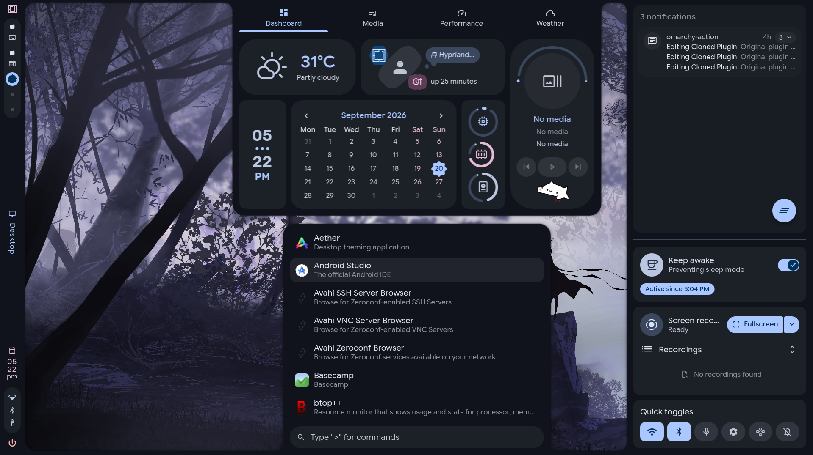

# Omacale

A [Caelestia](https://github.com/caelestia-dots/shell)-style desktop shell for [Omarchy](https://omarchy.org).

[](LICENSE)



Omacale is a single Omarchy bar plugin (`omacale.bar`). It runs inside Omarchy's own shell: no extra daemon, no build step, no required Hyprland changes. Caelestia provides the look; Omarchy stays the engine.

## Features

- **Frame and drawers**: Caelestia's shader-drawn screen frame, with dashboard, launcher, sidebar, utilities, session and settings sliding out of it.
- **Material 3 colours** generated from your Omarchy theme.
- **Bar**: workspaces, active window (live preview and window actions), tray, clock, status icons and popouts. Crowded items collapse on their own.
- **Launcher**: apps, calculator (`>calc`), wallpaper and theme pickers (`>wallpaper`, `>theme`), and the Omarchy menu (`:`).
- **Dashboard**: weather, calendar, system resources, and media with synced lyrics.
- **Notifications**: toasts that stay above fullscreen windows, plus a history sidebar.
- **Workspace overview** with live previews and drag-and-drop.
- **Lock screen**: Caelestia's design on top of Omarchy's own lock and PAM.
- **Desktop clock and audio visualiser** (optional).
- **Plugin manager** and hosting for third-party Omarchy bar widgets.
- **Keyboard-driven**: every panel works with `h` `j` `k` `l`, Enter and Escape.
- **Settings app** for everything above, applied live.
- **UI scale**: follows Omarchy's font size (`[font] base-size` in `~/.config/omarchy/shell.toml`) or a size of your own, with separate text, padding, spacing and rounding scales. Unlike Caelestia, the drawers and bar scale with it too, so a smaller UI also takes less room.

## Requirements

- Omarchy, with its shell running
- `jq`
- Material Symbols Rounded font (added by the installer if missing)
- `cava` (optional, for the visualiser)

## Install

```bash
git clone https://github.com/AyushKr2003/omacale.git
cd omacale
./install.sh
```

The installer copies the plugin to `~/.config/omarchy/plugins/omacale.bar`, makes it the active bar, and records your previous setup so it can be restored.

| Command | Purpose |
|---|---|
| `./uninstall.sh` | Restore your previous bar exactly |
| `scripts/omacale status` | Show what is installed |
| `scripts/omacale doctor` | Check the installation |
| `scripts/omacale install --dry-run` | Preview an install |
| `scripts/omacale install --dev` | Symlink the plugin for development |

### Optional setup

- **Keybindings**: copy them from **Settings › Keybinds**, or paste [`omacale.bar/keybinds.lua`](omacale.bar/keybinds.lua) into `~/.config/hypr/bindings.lua`.
- **Window styling** (Caelestia borders, animations and shadows): add to `~/.config/hypr/looknfeel.lua`:

  ```lua
  pcall(dofile, os.getenv("HOME") .. "/.config/omarchy/plugins/omacale.bar/omacale.lua")
  ```

- **Notification toasts** and the **lock screen**: offered during install. Change either later in **Settings › Notifications** and **Settings › Panels › Lock screen**.

## Usage

### Keybindings

| Key | Action |
|---|---|
| `SUPER + A` | Launcher |
| `SUPER + D` | Dashboard |
| `SUPER + N` | Notifications sidebar |
| `SUPER + U` | Quick toggles |
| `SUPER + TAB` | Workspace overview |
| `SUPER + SHIFT + I` | Settings |
| `SUPER + SHIFT + ESCAPE` | Session menu |
| `SUPER + CTRL + 0` | Bar focus: move through the bar with the keyboard |
| `SUPER + CTRL + W` / `B` / `P` / `A` | Network / Bluetooth / Power / Audio popout (Omarchy's own keys) |
| `SUPER + CTRL + 1..9` | Third-party bar widgets, top to bottom (Omarchy's own keys) |

### Keyboard navigation

A focus ring appears only when you use the keys, so mouse use is unchanged.

| Key | Action |
|---|---|
| `h` `j` `k` `l` / arrows | Move |
| `Enter` / `Space` | Activate |
| `Tab` / `Shift + Tab` | Next / previous popout or tab |
| `x` | Remove (network, device, notification, recording) |
| `Escape` | Close, or go back to the bar |

<details>
<summary>Keys for each panel</summary>

| Panel | Keys |
|---|---|
| Bar focus | `1..9` switch workspace; `Menu` or `Shift + F10` opens a tray item's menu |
| Tray menu | `→` open submenu, `←` back, a letter jumps to an entry |
| Network | `r` rescan |
| Audio | `m` mute; `←` / `→` on the slider change the volume |
| Dashboard | Moving along the tabs opens them; `1..4` jump to a tab; `n` / `p` change track |
| Sidebar | `d` do not disturb, `Shift + X` clear all |
| Settings | `/` search, `Backspace` previous page |
| Launcher `:` menu | Type to filter; `Enter` / `→` open, `Backspace` / `←` back |

</details>

### Command line

```bash
omarchy-shell omacale <launcher|dashboard|sidebar|utilities|overview|session|settings|close>
omarchy-shell omacale <wallpapers|themes|menu|windowInfo|barFocus>
omarchy-shell omacale dashboardTab <dashboard|media|performance|weather>
omarchy-shell omacale settingsPage <page>
omarchy-shell omacale popout <network|bluetooth|audio|battery|kblayout|lockstatus|update|activewindow>
omarchy-shell omacale scale <omarchy|0.5-2|50%-200%>                  # empty prints the current scale
```

## Omarchy integration

Omacale changes how things look, never how they work underneath.

- **Notifications**: Omarchy's daemon keeps the server, do not disturb and history. Omacale only draws the toasts.
- **Lock screen**: Omarchy keeps the session lock, PAM and idle timers. Omacale only draws the view, and Omarchy's view comes back if Omacale is off or missing.
- **Scale**: by default Omacale follows the size set in Omarchy's `shell.toml` (`[font] base-size`, `[spacing] scale`), so the stock bar and Omacale grow and shrink together.
- **Updates**: when `omarchy update` changes those plugins, Omacale rebuilds its copies from the new version. If a copy stops working, Omarchy's original is restored automatically and you get a notification.

<details>
<summary>Manage the handovers by hand</summary>

```bash
omacale.bar/scripts/notif-popups <status|install|remove|health>
omacale.bar/scripts/lock-screen  <status|install|remove|health>
```

</details>

## Development

```bash
./scripts/omacale install --dev                                          # live-editing symlink
rsync -a omacale.bar/ ~/.config/omarchy/plugins/omacale.bar/ && omarchy-restart-shell
bash tests/test-restore.sh                                               # test suite
scripts/upstream-check                                                   # what changed in Omarchy since last verified
```

Architecture, conventions and design tokens are documented in [`CLAUDE.md`](CLAUDE.md).

## Limitations

- Volume and brightness use Omarchy's on-screen display.
- The lock screen shows your wallpaper, not a blurred snapshot of the desktop. With a video wallpaper, the blur applies to its still frame only.
- Notifications support their default action only; there are no inline replies.

## Credits

- UI and shaders: [caelestia-dots/shell](https://github.com/caelestia-dots/shell) (GPL-3.0)
- Workspace overview: adapted from [omarchy-overview](https://github.com/AyushKr2003/omarchy-overview) and [quickshell-overview](https://github.com/Shanu-Kumawat/quickshell-overview)
- Fonts: Google Sans Flex and Rubik (SIL Open Font License)

## License

[GPL-3.0](LICENSE)
